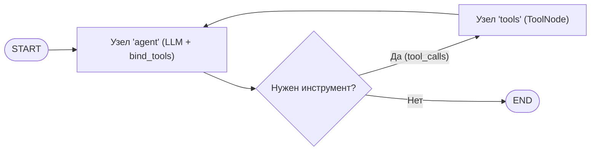
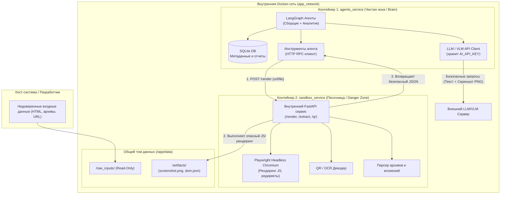

# Журнал разработки и архитектура проекта DW-2

Этот документ фиксирует архитектуру, структуру и прогресс разработки проекта.

---

## 1. Общая архитектура и технологии

Проект построен на базе **LangGraph** и изолированных Docker-контейнеров:

1. **`agents_service` (Контейнер 1: Чистая зона / Brain & Controller)**
   - **Фреймворк:** **LangGraph** (графы состояний `StateGraph`, `ToolNode`, `tools_condition`).
   - **Назначение:** Оркестрация 2-х ИИ-агентов (Сборщик и Аналитик), координация работы, обращение к LLM/VLM по API, работа с базой данных SQLite.
   - **Безопасность:** Хранит секреты и API-ключи, **НЕ исполняет** недоверенный JS/код, не открывает подозрительные страницы напрямую. Общается с песочницей через внутренний API.
2. **`sandbox_service` (Контейнер 2: Изолированная «грязная» зона / Danger Zone / Sandbox)**
   - **Назначение:** Безопасное исполнение всех потенциально опасных операций: Headless Playwright (Chromium), рендеринг HTML/JS, перехват редиректов и сетевого трафика, снятие скриншотов, распаковка подозрительных архивов/вложений, распознавание QR-кодов.
   - **Безопасность:** Запуск от непривилегированного пользователя (`pwuser`), сброс Linux capabilities (`cap_drop: [ALL]`), `no-new-privileges: true`, лимиты ресурсов (RAM/CPU), отсутствие доступа к секретам API и базе данных.
   - **Интерфейс:** Внутренний микросервис (FastAPI), возвращающий чистый структурированный JSON и безопасные медиа-артефакты (скриншоты PNG).

---

## 2. Структура проекта

```text
dw-2/
├── configs/                  # Все конфигурационные файлы проекта (JSON)
│   └── agents/               # Конфигурации агентов
│       ├── react_agent.json      # Базовый демо-агент (все инструменты)
│       ├── collector_agent.json  # Агент-Сборщик: собрать всё от стартовой точки
│       └── analyst_agent.json    # Агент-Аналитик: разобрать собранное, вердикт
├── core/                     # Инфраструктура и клиенты API
│   ├── __init__.py
│   ├── ai_client.py          # Фабрика ChatOpenAI (get_chat_model), ask_llm, ask_vlm
│   └── config_loader.py      # Загрузчик JSON-конфигов (load_agent_config, load_json_config)
├── agents/                   # ИИ-Агенты на базе LangGraph
│   ├── __init__.py
│   └── base_agent.py         # Базовый ReAct-агент на StateGraph с поддержкой from_config()
├── tools/                    # Инструменты ДЛЯ агентов (LangChain / LangGraph @tool)
│   ├── __init__.py           # Реестр инструментов (AVAILABLE_TOOLS, get_tools)
│   ├── base_tool.py          # Экспорт BaseTool и декоратора @tool
│   ├── analysts/             # БЕЗОПАСНЫЕ инструменты анализа (LLM/VLM, без исполнения)
│   │   ├── __init__.py
│   │   ├── analyze_snippet.py     # LLM-разбор фрагмента вне контекста
│   │   ├── analyze_screenshot.py  # VLM-анализ скриншота (бренд, признаки)
│   │   └── hash_artifacts.py      # md5/sha256 файлов для сигнатур
│   └── collector/            # RPC-инструменты сбора через песочницу
│       ├── __init__.py       # Экспорт render_page, extract_links, unpack, qr, eval_js, run_shell
│       ├── http_proxy.py     # HTTP-клиент вызова песочницы (SANDBOX_URL)
│       ├── render_page.py    # RPC-тулза: рендер страницы в headless Chromium
│       ├── extract_links.py  # RPC-тулза: все ссылки из HTML/DOM
│       ├── extract_qr.py     # RPC-тулза: декодирование QR
│       ├── unpack_attachment.py  # RPC-тулза: безопасная распаковка вложений
│       ├── eval_js.py        # RPC-тулза: прогон JS (скрытые ссылки)
│       └── run_shell.py      # RPC-тулза: команда в консоли песочницы (strings/file/grep)
├── sandbox/                  # Код контейнера-песочницы (грязная зона)
│   ├── __init__.py
│   ├── app.py                # FastAPI: /ping, /render, /extract_qr, /unpack, /eval_js, /extract_links, /run_shell
│   ├── schemas.py            # Pydantic-схемы (валидация входов)
│   └── services/             # Изолированные реализации
│       ├── __init__.py
│       ├── renderer.py       # Playwright Headless Chromium (JS, редиректы, скриншоты)
│       ├── qr_reader.py      # QR-декодирование
│       ├── unpacker.py       # Безопасная распаковка (защита от path traversal)
│       ├── js_runner.py      # Прогон JS-сниппета в изолированном браузере
│       ├── extractor.py      # Извлечение всех ссылок из HTML/DOM
│       └── runner.py         # Безопасное выполнение консольных команд (whitelist)
├── docker/
│   └── sandbox/              # Docker-мета песочницы
│       ├── Dockerfile        # Playwright-образ + non-root pwuser + tools (strings/OCR)
│       └── requirements.txt  # Пакеты песочницы
├── prompts/
│   ├── __init__.py
│   ├── react_system.md       # Базовый промпт
│   ├── collector_system.md   # Промпт Агента-Сборщика (собрать всё)
│   └── analyst_system.md     # Промпт Агента-Аналитика (вердикт)
├── docs/
│   ├── project_log.md        # Журнал разработки и архитектура
│   └── overview.md           # Понятное описание проекта
├── .env.example              # Пример файла с секретами (AI_API_KEY, SANDBOX_URL)
├── .dockerignore             # Что не попадает в docker-образ
├── Dockerfile.agent          # Сборка чистой зоны (агент), без браузера
├── docker-compose.yml        # 2 контейнера: agents_service (чистая) + sandbox_service (грязная)
├── main.py                   # Точка входа
└── requirements.txt          # Пакеты Python (langgraph, httpx и др.)
```

---

## 3. Принцип конфигурации через JSON

Все параметры агентов (модель, температура, имя файла промпта, список инструментов, verbose и т.д.) строго хранятся в JSON-файлах:

```json
{
  "agent_name": "react_agent",
  "description": "Базовый ReAct-агент для решения задач с использованием инструментов",
  "model": {
    "name": "Qwen3.8-27B",
    "temperature": 0.7
  },
  "prompt_file": "react_system.md",
  "tools": ["render_page", "extract_qr", "unpack_attachment"],
  "verbose": true
}
```

Создание агента выполняется в одну строчку:
```python
agent = BaseAgent.from_config("react_agent.json")
```

---

## 4. Как устроен ReAct-граф в LangGraph

Граф строится с помощью `StateGraph(AgentState)`:



- **`AgentState`**: список сообщений диалога с поддержкой добавления сообщений (`add_messages`).
- **Узел `agent`**: вызывает модель со списком привязанных инструментов (`model.bind_tools(tools)`).
- **Условный переход (`tools_condition`)**: автоматически направляет поток в узел `tools`, если модель вернула `tool_calls`, либо завершает работу в `END`.
- **Узел `tools` (`ToolNode`)**: выполняет вызванные инструменты и возвращает `ToolMessage` обратно в модель.

---

## 5. Архитектура безопасности: Изоляция через 2 Docker-контейнера

Для защиты от вредоносного кода, XSS, 0-day уязвимостей в браузерных движках и скрытых угроз во входящих файлах система разделена на **две изолированные зоны**:



### Детальное разграничение обязанностей:

| Параметр / Зона | **Контейнер 1: `agents_service` (Brain)** | **Контейнер 2: `sandbox_service` (Sandbox)** |
| :--- | :--- | :--- |
| **Уровень доверия** | Высокий (доверенная зона управления) | Низкий (изолированная среда выполнения угроз) |
| **Роль** | Оркестрация LangGraph, принятие решений, диалог с LLM/VLM, запись в SQLite | Рендеринг подозрительного HTML/JS, проход по редиректам, распаковка архивов, снятие скриншотов |
| **Секреты и API-ключи** | **Хранятся** (`AI_API_KEY`, токены) | **НЕТ ДОСТУПА** к API-ключам и секретам |
| **Исполнение JS/кода** | **Запрещено** (чистый Python без выполнения кода со страниц) | **Разрешено в песочнице** Chromium |
| **Пользователь Linux** | Обычный | `non-root` пользователь (`pwuser`, UID 1000) |
| **Харденинг Docker** | Стандартный | `cap_drop: [ALL]`, `no-new-privileges: true`, лимиты памяти/CPU |
| **Канал связи** | Отправляет RPC-запросы в контейнер 2 | Принимает RPC-запросы, отдает безопасный JSON |

---

## 6. Шаги разработки

### Этап 1: Настройка среды и Docker (Завершено)
- [x] Проверена и настроена работа Docker Desktop и WSL 2.
- [x] Создана базовая структура `docker-compose.yml` на 2 сервиса (`dw2_agents`, `dw2_secondary`).
- [x] Создана папка `docs/` для фиксации всех изменений.

### Этап 2: Инфраструктура, ReAct на LangGraph и JSON-конфигурация (Завершено)
- [x] Создана директория `configs/agents/` для хранения всех параметров в JSON.
- [x] Создан загрузчик конфигураций [core/config_loader.py](file:///c:/Main/working/python-projects/dw-2/core/config_loader.py).
- [x] Создан реестр инструментов в [tools/__init__.py](file:///c:/Main/working/python-projects/dw-2/tools/__init__.py) для сопоставления названий из JSON с функциями.
- [x] Реализована фабрика `BaseAgent.from_config()` в [agents/base_agent.py](file:///c:/Main/working/python-projects/dw-2/agents/base_agent.py).
- [x] Проверена и отлажена работа в [main.py](file:///c:/Main/working/python-projects/dw-2/main.py).

### Этап 3: Реализация архитектуры безопасности двух контейнеров (Завершено)
- [x] Настройка `sandbox_service`: Dockerfile на базе официального Playwright-образа, non-root `pwuser`, FastAPI-сервер песочницы.
- [x] Эндпоинты песочницы: `/ping`, `/render`, `/extract_qr`, `/unpack`.
- [x] RPC-инструменты агента в `tools/collector/` (`render_page`, `extract_qr`, `unpack_attachment`) — агент НЕ исполняет опасный код, только HTTP-вызовы.
- [x] Харденинг `docker-compose.yml`: `agents_service` (чистая зона, env_file c AI_API_KEY) + `sandbox_service` (грязная зона, без секретов, `cap_drop: [ALL]`, `no-new-privileges`, `read_only: true`, tmpfs `/tmp`, лимиты CPU/RAM), общий volume `data_volume`, сеть `app_network`.
- [x] Инструмент `calculate` полностью удалён из проекта (демо-тулза, не относится к задаче фишинг-анализа).

### Этап 4: Разработка агентов и сценария анализа фишинга
- [ ] Агент-Сборщик (Collector): обход структуры, сбор редиректов, сохранение в SQLite.
- [ ] Агент-Аналитик (Analyst): анализ контента, VLM-анализ скриншотов, вынесение вердикта по ТЗ.

### Этап 5: Новые инструменты и разделение агентов (Завершено)

**Принцип изоляции:** всё, что ИСПОЛНЯЕТ недоверенный код → в песочнице; только анализ (LLM/VLM, хэши) → в агенте. При этом ОБА агента делят один общий пул инструментов — разница только в цели (системный промпт), а не в наборе.

**Полный пул из 9 инструментов:**

Разведка/сбор (исполняется в песочнице):
- [x] `render_page` — открыть URL/HTML, редиректы, скриншот, признаки фишинга в DOM
- [x] `extract_links` — вытащить ВСЕ ссылки из HTML/DOM (href/src/action/iframe)
- [x] `unpack_attachment` — безопасная распаковка вложений (защита от path traversal)
- [x] `extract_qr` — декодирование QR
- [x] `eval_js` — прогон обфусцированного JS, достать спрятанные ссылки
- [x] `run_shell` — команда в консоли песочницы (strings/file/grep/xxd — whitelist)

Анализ/артефакты (исполняется в агенте — безопасно):
- [x] `analyze_snippet` — LLM-разбор фрагмента вне контекста
- [x] `analyze_screenshot` — VLM-анализ скриншота (бренд, признаки фишинга)
- [x] `hash_artifacts` — md5/sha256 файлов-артефактов для базы сигнатур

**Два агента:**
- [x] `configs/agents/collector_agent.json` + `prompts/collector_system.md` — Агент-Сборщик: собрать от стартовой точки всё (ссылки, редиректы, вложения, QR, скрытое в JS), продолжить копать глубже.
- [x] `configs/agents/analyst_agent.json` + `prompts/analyst_system.md` — Агент-Аналитик: разобрать собранное, признаки фишинга, бренд, хэши, вердикт/reason codes.
- [x] Новые сервисы песочницы: `extractor.py` (извлечение ссылок), `runner.py` (безопасная консоль).

### Этап 6: Работа с документами и файлами (Завершено)
**Идея пользователя:** markitdown + рендер документов в картинки (для VLM-анализа).

- [x] `documents.py` в песочнице — `extract_document` (markitdown → PDF/Office/письма в Markdown + список URL) и `render_pdf_to_png` (PyMuPDF → PNG страниц).
- [x] Эндпоинты песочницы: `/extract_document`, `/render_pdf`.
- [x] Прокси-тулзы агента: `extract_document`, `render_pdf_to_png` — добавлены в реестр, конфиги агентов, промпты.
- [x] Зависимости: `markitdown[pdf]` (обязательный доп. пакет для PDF), `PyMuPDF`.
- [x] Полный цикл проверен вживую на тестовом PDF: текст извлечён, ссылка `https://...` найдена, PNG-страница сгенерирована.
- [x] Принцип: рендер/парсинг (опасно) → песочница; текст/PNG → агенту; PNG → `analyze_screenshot` (VLM).

### Этап 7: Стабильный MVP (Завершено)

Ядро по ТЗ: вход → сбор → БД → артефакты.

- [x] `core/storage.py` — SQLite-схема: samples, urls (с редиректами), artifacts (с хэшами), brands, findings, signatures. БД живёт в чистой зоне.
- [x] `core/brand_detector.py` — **бренд-определитель через VLM** (`ask_vlm`): по скриншоту возвращает {brand, confidence, evidence}. Обязательный пункт по ТЗ (визуальная имитация брендов, подход Phishpedia).
- [x] `core/pipeline.py` — детерминированный пайплайн: `_collect_url/_collect_html/_collect_file` (через песочницу), `_analyze_brand` (VLM), `_generate_signatures`. Обходит URL-рендер, редиректы, ссылки из DOM, распаковку, QR, документы (PDF/Office), хэширование.
- [x] Генератор компактных артефактов по ТЗ: `signature`, `url_template`, `brand_feature`, `fingerprint` (sha256), `reason_code`.
- [x] `main.py` — CLI: `analyze <input> --type url|file|html`, `report <id>`, `stats`. Контейнер-агент живёт в режиме ожидания CLI-команд.
- [x] Правки песочницы: редиректы через события Playwright (нет `response.history`), DOM сохраняется в `dom.html` для извлечения ссылок, закреплён `playwright==1.49.0`.
- [x] **E2E проверен вживую** на `test_fixtures/phish_bank.html`: бренд **PrimeBank (VLM, conf 0.95)**, найдены credential_form (high), скрытый iframe, ссылки всех типов, сгенерированы 8 сигнатур (brand_feature, url_template ×4, fingerprint ×2, reason_code).

### Этап 8: Чистая песочница на каждый файл (вариант A MVP)
**Идея пользователя:** «если один контейнер заразили — прогонять каждый файл через чистую песочницу».

- [x] `scripts/reset_sandbox.sh` — пересоздаёт `sandbox_service` с НУЛЯ (`docker compose up -d --force-recreate`) и ждёт готовности `/ping`. Артефакты и БД в volume `data_volume` НЕ трогаются (там знания/отчёты).
- [x] `scripts/analyze_clean.sh` — свежая песочница на каждый файл: reset → дождаться → `docker exec dw2_agents python main.py analyze ...`.
- [x] **Важно:** рестарт выполняется СНАРУЖИ (с хоста), а НЕ из контейнера агента — агенту НЕ выдаётся docker-socket (это разорвало бы изоляцию).
- [x] **Баг, пойманный при дебаге:** `docker compose up <svc>` использует имя СЕРВИСА (`sandbox_service`), а `docker exec`/`inspect` — имя КОНТЕЙНЕРА (`dw2_sandbox`). Не путать.
- [x] Проверено вживую: `analyze_clean.sh` → свежий контейнер → образец #6 проанализирован (PrimeBank, 8 сигнатур).

### Этап 9: Подключение агентов + критические фиксы + download_file (Завершено)

**Идея пользователя:** два свободных ReAct-агента (как агенты для программирования),
каждый в рамках только своей задачи; инструменты — ОДИНАКОВЫЕ у обоих; сборщик
ходит по цепочке «ссылка → файл» и скачивает всё; аналитик выдаёт вердикт с хэшами.

**Критические фиксы:**
- [x] `sandbox/services/runner.py` — `run_shell` падал на каждой команде (`MAX_OUTPUT` вместо `MAX_OUTPUT_CHARS`).
- [x] QR-декодер не работал: добавлены `pyzbar` (pip) + `libzbar0` (apt) → `/extract_qr` проверен вживую.
- [x] `test_fixtures/` не попадал в контейнер агента — добавлен маунт в `docker-compose.yml`.
- [x] В образе песочницы физически не хватало `file`, `xxd`, `hexdump` (были в whitelist, но не установлены) — добавлены в `Dockerfile.sandbox`.
- [x] `RenderRequest` не принимал `task_id` → скриншоты рендера ложились в случайные папки вместо `sample_N`. Поле добавлено, в рендерере — санитизация имени.

**Новый инструмент `download_file` (единственный недостающий для идеи):**
- [x] `sandbox/services/downloader.py` + эндпоинт `/download`: скачивает файл по ссылке на общий том (только байты, никакого исполнения; лимит 20 МБ; только http/схемы запрещены; редирект-цепочка сохраняется).
- [x] `tools/collector/download_file.py` — RPC-тулза.

**Уравнивание инструментов:**
- [x] Оба агента (`collector_agent`, `analyst_agent`) получили ОДИНАКОВЫЙ набор из 12 инструментов.

**Устойчивость агентов:**
- [x] `ToolNode(handle_tool_errors=True)` — ошибка тулзы больше не убивает граф: агент видит её как наблюдение и исправляет аргументы (как обычные агенты).
- [x] `sandbox_request` больше НЕ бросает исключения — возвращает `{"ok": False, "error": <текст причины>}` из тела ответа песочницы. Агент видит, ЧТО не получилось (например, «домен не резолвится»), и не зацикливается.
- [x] В задаче сборщика — правило: недоступный адрес = одна попытка, домены-заглушки (*.example) только перечисляются.

**Оркестратор (`core/orchestrator.py`):**
- [x] `run_agent_pipeline()`: вход → (файл копируется на том при необходимости) → детерминированная подготовка стартовой точки (функции пайплайна переиспользуются: `collect_url/collect_html/collect_file` стали публичными) → **Сборщик** (свободный ReAct, ≤40 шагов) → трейсы в `agent_traces` → детерминированная фиксация: ВСЕ файлы папки артефактов хэшируются и заносятся в БД независимо от памяти модели → **Аналитик** (свободный ReAct, ≤25 шагов) → вердикт сохраняется как `analyst_report.md` (артефакт с хэшами) → бренд (VLM) + сигнатуры → статус `analyzed`.
- [x] `main.py`: `--mode agent` (по умолчанию) / `--mode pipeline` (быстрый детерминированный).

**Проверено вживую (образец #9, `phish_bank.html`):**
- Сборщик: 21 шаг — ссылки, чтение файла, обфускация `atob` → `eval_js`, попытки рендеров недоступных доменов без зацикливания.
- Аналитик: 9 шагов — скриншот через VLM, разбор JS через LLM, **перепроверил и исправил ошибку сборщика** (неточное декодирование base64).
- Трейсы обоих агентов в БД; вердикт: фишинг, бренд PrimeBank, 5 техник (credential_form, brand_impersonation, obfuscated_js, hidden_iframe, html_attachment), уверенность 0.97; 13 сигнатур; хэши в отчёте совпадают с БД.

### Этап 10: Интеллектуальный каталог брендов и Open-Set Brand Resolver (Завершено)
- [x] Добавлен расширенный каталог на **175 целевых брендов** (`configs/target_brands.json`): банки РФ/СНГ/мира, телеком, госсервисы (Госуслуги, ФНС, Мои Документы), криптобиржи, e-commerce, облачные сервисы (Microsoft, Google, Apple) с их легитимными FQDN.
- [x] `core/brand_detector.py`: реализован `resolve_brand(raw_name)` — сопоставление алиасов, русскоязычных названий («Сбер», «Тинькофф», «ВТБ») с каноническими брендами.
- [x] Реализован механизм **Open-Set детекции**: если бренд вне каталога, VLM распознает его по визуальным элементам, а система присваивает эвристический домен или фиксирует бренд с пониженным базовым доверием.
- [x] Проверка Domain Mismatch (Brand Impersonation): автоматическое выявление несовпадения домена страницы с доверенными FQDN бренда.

### Этап 11: Профессиональный рефакторинг имен и изоляции (Завершено)
- [x] Полное устранение внутренних кодовых префиксов `dw2_` в пользу `threat_`:
  - `threat_agents` — контейнер чистой зоны (Brain / Orchestrator / LangGraph).
  - `threat_sandbox` — контейнер грязной зоны (Playwright Chromium, RO-rootfs, сброшенные capabilities, непривилегированный `pwuser` UID 1000).
- [x] CLI `main.py`: программа переименована в `threat-intel`, обновлены логи и баннеры (`[ThreatIntel]`).
- [x] `docs/INSTRUCTION.md`, `docs/USAGE.md`, `scripts/analyze_clean.sh`, `scripts/reset_sandbox.sh` актуализированы под новые имена контейнеров.

### Этап 12: Глубокий DOM-анализ, остов страницы, SimHash и аудит Form Action (Завершено)
- [x] `core/dom_analyzer.py`:
  - `extract_dom_skeleton(html)`: Очистка страницы от текста, пробелов, динамических атрибутов и скриптов. Формирование токенизированного остова тегов (`<html><body><div><form><input:password><button>`).
  - `compute_dom_hash(skeleton)`: Вычисление криптографического SHA-256 хэша остова для выявления идентичных landing page шаблонов независимо от домена.
  - `compute_simhash(skeleton)` / `simhash_similarity()`: 64-битный нечеткий SimHash n-грамм для поиска мутировавших версток фишинг-китов.
  - `analyze_forms_deep(html, page_url)`: Глубокий аудит форм — детекция кросс-доменной отправки (`has_cross_domain_post`), выявление прямых C2-вебхуков в Telegram Bot API (`api.telegram.org/bot...`) и Discord, подсчет полей паролей/карт, поиск скрытых форм (`display:none`, `opacity:0`).
- [x] Интеграция в детерминированный пайплайн и агентский цикл оркестратора.
- [x] Генерация Reason Codes: `CROSS_DOMAIN_CREDENTIAL_THEFT`, `CREDENTIAL_HARVESTING_FORM`.

### Этап 13: Favicon Intelligence (Завершено)
- [x] `core/favicon_analyzer.py`:
  - `extract_favicon_urls(html, base_url)`: Извлечение ссылок на иконки из `<link rel="icon">`, `shortcut icon`, `apple-touch-icon` с автоматическим fallback на `/favicon.ico`.
  - **Dual Hashing**: вычисление криптографического хэша (MD5/SHA-256) и перцептивного **dHash (difference hash)** через `Pillow`.
  - Устойчивость dHash: инвариантен к сжатию, смене формата (PNG ↔ ICO) и незначительным искажениям цвета.
  - `dhash_distance(h1, h2)`: сравнение расстояния Хэмминга с эталонами брендов (подход Phishpedia).

### Этап 14: Детектор обфускации, энтропия Шеннона и маркеры Phishing Kits (Завершено)
- [x] `core/obfuscation_detector.py`:
  - `calculate_shannon_entropy(text)`: расчет информационной энтропии скриптов (значения > 5.2 маркируют зашифрованные пэйлоады и base64-блобы).
  - Детекция упаковщиков: Dean Edwards Packer, JSFuck, `String.fromCharCode`, цепочки `eval(atob(...))`.
  - Поиск маркеров фишинг-китов: скрипты антиботов (`antibot.php`, `killbot`), характерные пути админок и журналов жертв (`/panel/login.php`, `/logs.txt`, `/victim.txt`).
- [x] Генерация Reason Codes: `OBFUSCATION_DEAN_EDWARDS_PACKER`, `OBFUSCATION_JSFUCK`, `PHISHING_KIT_MARKER_*`.

### Этап 15: Кластеризация кампаний (Campaign Tracking) (Завершено)
- [x] `core/storage.py`: в SQLite добавлена таблица `campaigns` (`id`, `name`, `target_brand`, `dom_hash`, `kit_name`, `sample_count`, `first_seen`, `last_seen`) и автоматическая миграция колонки `campaign_id` в таблице `samples`.
- [x] `core/campaign_cluster.py`: автоматическое связывание образцов по совпадению `(целевой бренд + одинаковый dom_hash)` в единые кампании с инкрементом счетчиков.
- [x] Фиксация связей через Reason Codes: `CAMPAIGN_MEMBER_<NAME>`, `CAMPAIGN_INIT_<NAME>`.
- [x] CLI-команда: `python main.py campaigns [--json]`.

### Этап 16: Движок экспорта правил для локального антиспама (Завершено)
- [x] `core/rule_exporter.py`: реализация главного практического требования Task.md — подготовка компактных правил для локальных антиспам-движков.
- [x] **JSON-Rulepack**: правила по брендам, DOM-шаблоны, шаблоны URL-путей, хэши вредоносных вложений, активные reason codes со скорингом.
- [x] **Rspamd Rules**: генерация нативного конфигурационного файла Lua с символами и скорингом.
- [x] **YARA Rules**: правила фильтрации вложений по хэшам артефактов.
- [x] CLI-команда: `python main.py export-rules --format json|rspamd|yara [--out <file>]`.

### Этап 17: Адаптивная нормализация и очистка QR-кодов от шума на Pillow (Завершено)
- [x] `sandbox/services/qr_reader.py`: внедрен многоступенчатый ленивый каскад предобработки зашумленных и обфусцированных QR-кодов:
  1. Оригинал (1 мс).
  2. Grayscale + Автоконтраст (`ImageOps.autocontrast`).
  3. Медианный фильтр 3x3 (`ImageFilter.MedianFilter(3)`) — эффективное удаление искусственного шума «соль и перец» и зерна.
  4. Адаптивная бинаризация методом Оцу (`_otsu_threshold`) для преодоления теней и градиентов.
  5. Цветовая инверсия (`ImageOps.invert`) для Dark Mode кодов (белый QR на черном фоне).
  6. Двукратный апскейлинг (Upscale 2x) для мелких/сжатых изображений.
- [x] Автоматическая детекция Quishing-обфускации: если QR прочитан только после фильтрации, генерируется finding `qr_obfuscation` (`severity: high`) и Reason Code `QR_OBFUSCATION_DENOISED_MEDIAN`.
- [x] Проверено вживую на образце #19 (зашумление 12% битых пикселей): сырой код не распознавался, после медианного фильтра успешно декодирован.

### Этап 18: Переход на единую двух-агентную архитектуру и удаление легаси-пайплайна (Завершено)
- [x] **Удаление лишнего:**
  - Полностью удален процедурный режим `run_pipeline()` из `core/pipeline.py`.
  - Удален флаг `--mode` (`agent`/`pipeline`) из `main.py`.
- [x] **Единая архитектура (Сборщик → Handover → Аналитик):**
  - Любой анализ через `python main.py analyze` теперь всегда запускает последовательную двух-агентную связку.
  - Агент 1 (Сборщик): активная разведка и сбор артефактов в песочнице.
  - Handover: детерминированная фиксация артефактов и передача фактуры.
  - Агент 2 (Аналитик): семантический анализ (VLM, бренд, формы, остов) и формирование вердикта.
  - Финализация: компактные сигнатуры и правила антиспама.
- [x] Добавлены сквозные тесты `tests/test_two_agent_workflow.py` (23 unit теста успешно проходят).
- [x] Документация `docs/INSTRUCTION.md` и `docs/USAGE.md` приведена в полное соответствие с единой архитектурой.

